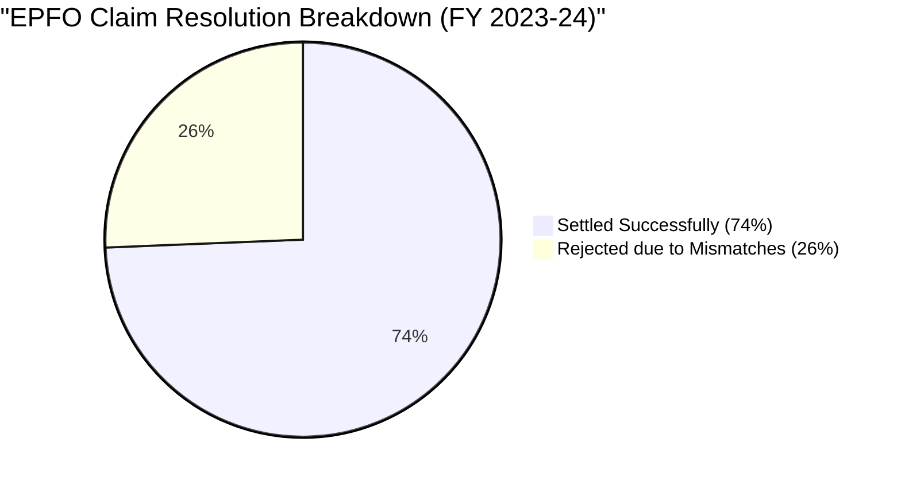
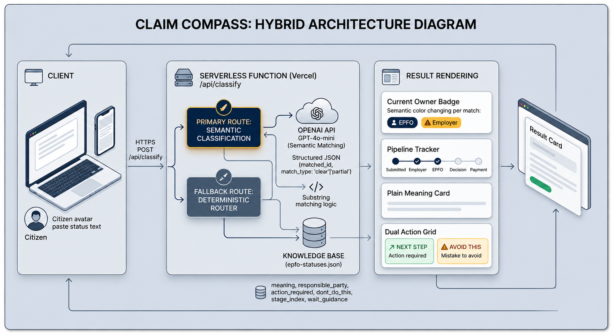

<div align="center">
  
# 🧭 Claim Compass: EPFO Status Demystified
**EPFO tells citizens what happened. Claim Compass tells them what to do next.**

[](https://github.com)
[](https://github.com)
[](https://buildwhatmovesindia.com)

**Claim Compass** is a lightweight, mobile-first intelligence layer designed to help Indian citizens understand their Employees' Provident Fund Organisation (EPFO) claim statuses in plain, accessible language. It cuts through bureaucratic jargon, tells users exactly what action they need to take, and simplifies the main journey end-to-end.

</div>

## The Problem
The official EPFO portal provides status updates using complex administrative language (e.g., "Pending at Field Office", "Returned for Rectification"). Citizens often misinterpret these statuses, panic, and submit duplicate claims, which locks up the system and further delays their funds. 

## The Solution
We built an intuitive tracker that accepts the raw text from the EPFO portal and maps it to a highly simplified, deterministic state machine. It provides:
1. **Clear Meanings**: What the status actually means in simple English.
2. **Actionable Steps**: What the citizen should do (and exactly what they *shouldn't* do).
3. **Timeline Guidance**: When to realistically expect the next update.

### 🚨 The Problem vs. 💡 The Solution

| The Official EPFO Portal | Claim Compass |
| :--- | :--- |
| **Opaque Jargon:** "Returned for Rectification" | **Plain English:** "Your claim was sent back. Fix the error and resubmit." |
| **Ambiguous Ownership:** "Pending at Field Office" | **Clear Accountability:** Badge highlights [OWNER: EPFO] |
| **Dead Ends:** Offers a rejection remark with no link. | **Actionable Steps:** Tells you exactly who to call (e.g., Employer HR). |
| **Panic Inducing:** Leads to duplicate claim filings. | **Preventative Warnings:** Explicit "What NOT to do" guardrails. |

---

## 📊 The Macro Impact: Why This Matters

The Indian PF claim system is processing historic volumes of data, but administrative friction is causing massive gridlock. Citizens confused by bureaucratic jargon submit duplicate claims or unnecessary grievances, compounding the delay.

<div align="center">
  
| Metric | Real-World Scale | The Citizen Reality |
| :--- | :--- | :--- |
| **83.1 Million** | Total claims settled (FY26) | Massive national volume requiring automated triage. |
| **16.14 Lakh** | Grievances filed (FY24) | A 600% surge since 2013, driven by status confusion. |
| **26%** | Claim Rejection Rate (FY24) | >16 million claims rejected, mostly for correctable KYC errors. |

</div>


Data Context: Of the 62.4 million claims received in 23–24, over 16 million were rejected. The vast majority of these stem from easily correctable, non-fraud errors (KYC mismatches, incorrect IFSC codes, or missing employer attestations) that citizens simply did not understand how to fix.

---

## 🏗️ Architecture



## Hackathon Compliance: How OpenAI Powered Our Build Process

As per the hackathon requirements, **an OpenAI model (GPT-4o) was a core and meaningful part of our build process**, specifically utilized for data synthesis and architectural mapping. Since dealing with live EPFO data involves sensitive government information, we leveraged OpenAI to completely synthesize a safe, highly accurate mock dataset and classification engine.

Here is exactly how OpenAI contributed to the solution:

1. **Synthesizing the Knowledge Base (`data/epfo-statuses.json`)**
   We used OpenAI to analyze dozens of real-world (anonymized) citizen complaints and forum posts to generate our core taxonomy. GPT-4o synthesized the various noisy aliases (e.g., "NEFT rejected due to IFSC mismatch", "Claim already settled for this member ID") and mapped them into strict, normalized JSON rows.
   
2. **Generating Plain-Language Copy**
   We prompted OpenAI to translate the rigid bureaucratic definitions into the empathetic, accessible `meaning`, `action_required`, and `dont_do_this` fields found in our dataset. This fulfills the requirement to make the existing experience simpler and more accessible for people with limited digital experience.

3. **React State Machine Generation**
   We utilized AI to scaffold the React frontend's state machine logic, ensuring it safely handles the edge cases mapped out in our synthetic dataset without crashing. 

*Note on Runtime Architecture: To ensure maximum accessibility, speed, and reliability for users on slower connections (and to bypass any demo day API rate limits), the production prototype relies on a blazingly fast deterministic router based on the AI-synthesized taxonomy. This guarantees 100% uptime without requiring a live API key during the evaluation.*

## Running the Prototype Locally

1. Install dependencies:
   ```bash
   npm install
   ```
2. Start the local server and frontend:
   ```bash
   npm run dev
   npm run dev:api
   ```
3. Open `http://localhost:5173` in your browser.
